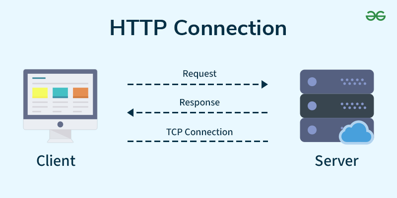
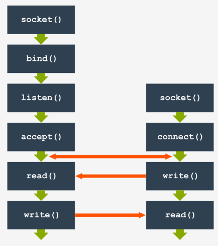
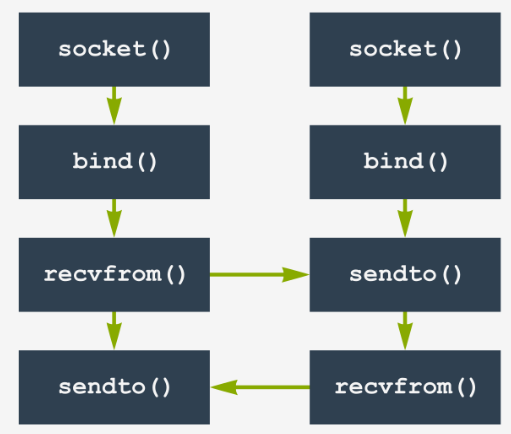

- [Introduction](#introduction)
- [Sockets](#sockets)
  - [Type of sockets](#type-of-sockets)
  - [Addressing sockets](#addressing-sockets)
  - [Socket APIs](#socket-apis)
    - [getprotobyname()](#getprotobyname)
    - [getservbyname()](#getservbyname)
    - [getaddrinfo()](#getaddrinfo)
    - [htonl(), htons(), ntohl(), ntohs()](#htonl-htons-ntohl-ntohs)
    - [socket()](#socket)
    - [setsockopt()](#setsockopt)
    - [bind()](#bind)
    - [listen()](#listen)
    - [accept()](#accept)
    - [connect()](#connect)
    - [recv()](#recv)
    - [send()](#send)
    - [close()](#close)
- [Programming Client-Server Models](#programming-client-server-models)
  - [Client-Server Architecture](#client-server-architecture)
  - [Simple HTTP Client](#simple-http-client)
  - [Simple TCP-Based Client-Server](#simple-tcp-based-client-server)
  - [Multithread TCP-Based Client-Server](#multithread-tcp-based-client-server)
  - [Simple UDP-Based Client-Server](#simple-udp-based-client-server)
- [Networking Libraries](#networking-libraries)
  - [Using libcurl](#using-libcurl)
    - [Basic Curl](#basic-curl)
    - [Curl Multiple Handle](#curl-multiple-handle)
    - [Curl Multithreading](#curl-multithreading)
  - [Secure Networking with OpenSSL](#secure-networking-with-openssl)
- [Conclusion](#conclusion)


# Introduction

Linux network programming deals with the interaction between processes using network interfaces. It enables interprocess communication (IPC), allowing data exchange between processes running on the same machine or on different machines connected over a network.

The foundation of Linux network programming lies in the use of sockets, a universal API designed for interprocess communication. Sockets originated from BSD Unix in 1983 and were later standardized by POSIX, making them a cornerstone of modern networking.

# Sockets

A socket is an endpoint for communication. Think of it as a door through which data flows in and out of a process. Processes use sockets to send and receive messages, enabling seamless IPC.

Sockets were initially designed to support two domains:

**Unix Domain (Unix)**: Used for communication between processes within the same operating system.

**Internet Domain (INET)**: Used for communication between processes on different systems connected via a TCP/IP network.

Unix domain sockets are used for IPC within the same operating system. They are faster than INET sockets because they don't require network protocol overhead. Instead of IP addresses, Unix domain sockets use file system paths for addressing.

INET domain sockets are used for communication between processes on different systems connected over a network. These sockets rely on the TCP/IP protocol stack, which ensures data integrity and delivery.

Two common protocols used with INET domain sockets are:

**TCP (Transmission Control Protocol)**: Provides reliable, ordered, and error-checked delivery of data.

**UDP (User Datagram Protocol)**: Provides fast, connectionless data transmission without guarantees of delivery.

## Type of sockets

The BSD socket API supports several types of sockets, which determine how data is transmitted between processes:

**Stream Sockets (SOCK_STREAM)**: These provide a reliable, connection-oriented communication protocol. Data is sent and received as a continuous stream of bytes. Typically used with TCP (Transmission Control Protocol).

**Datagram Sockets (SOCK_DGRAM)**: These provide a connectionless communication protocol. Data is sent in discrete packets, and delivery isn't guaranteed. Typically used with UDP (User Datagram Protocol).

**Raw Sockets (SOCK_RAW)**: These allow processes to access lower-level network protocols directly, bypassing the standard TCP or UDP layers. Useful for custom protocol implementations or network monitoring tools.

## Addressing sockets

In the INET domain, sockets are identified by two components:

**IP Address**: A 32-bit number (IPv4) or a 128-bit number (IPv6) that uniquely identifies a device on a network. IPv4 addresses are often represented in dotted decimal notation, such as 192.168.1.1.

**Port Number**: A 16-bit number that identifies a specific service or application on the device. For example, web servers typically use port 80 (HTTP) or 443 (HTTPS).

Check some of well-known services in Linux system via ```/etc/services``` file. Ports under 1024 are often considered special, and usually require special OS privileges to use.

```
worker@7e4a84e41875:~/study_workspace/LinuxNetworkProgramming$ cat /etc/services
tcpmux          1/tcp                           # TCP port service multiplexer
echo            7/tcp
echo            7/udp
...
ftp             21/tcp
fsp             21/udp          fspd
ssh             22/tcp                          # SSH Remote Login Protocol
telnet          23/tcp
smtp            25/tcp          mail
...
http            80/tcp          www             # WorldWideWeb HTTP
...
```

## Socket APIs

### getprotobyname()

```
#include <netdb.h>

struct protoent *getprotobyname(const char *name);
```

Sample usage:

```
struct protoent *proto;
proto = getprotobyname("tcp");
if (proto)
{
    printf("Protocol number for TCP: %d\n", proto->p_proto);
}
```

**Description**: ```getprotobyname()``` returns a ```protoent``` structure for the given protocol name, which contains information about the protocol.

### getservbyname()

```
#include <netdb.h>

struct servent *getservbyname(const char *name, const char *proto);
```

Sample usage:

```
struct servent *serv;
serv = getservbyname("http", "tcp");
if (serv)
{
    printf("Port number for HTTP: %d\n", ntohs(serv->s_port));
}
```

**Description**: ```getservbyname()``` returns a ```servent``` structure for the given service name and protocol, which contains information about the service.

### getaddrinfo()

```
#include <sys/types.h>
#include <sys/socket.h>
#include <netdb.h>

struct addrinfo {
    int              ai_flags;     // AI_PASSIVE, AI_CANONNAME, etc.
    int              ai_family;    // AF_INET, AF_INET6, AF_UNSPEC
    int              ai_socktype;  // SOCK_STREAM, SOCK_DGRAM
    int              ai_protocol;  // use 0 for "any"
    size_t           ai_addrlen;   // size of ai_addr in bytes
    struct sockaddr *ai_addr;      // struct sockaddr_in or _in6
    char            *ai_canonname; // full canonical hostname

    struct addrinfo *ai_next;      // linked list, next node
};
 
int getaddrinfo(const char *node,     // e.g. "www.example.com" or IP
                const char *service,  // e.g. "http" or port number
                const struct addrinfo *hints,
                struct addrinfo **res);
```

Struct ```addrinfo``` has the pointer to struct ```sockaddr``` which is used in many socket functions.

Sample usage:

```
int status;
struct addrinfo hints;
struct addrinfo *servinfo;  // will point to the results
 
memset(&hints, 0, sizeof(hints)); // make sure the struct is empty
hints.ai_family = AF_UNSPEC;     // don't care IPv4 or IPv6
hints.ai_socktype = SOCK_STREAM; // TCP stream sockets
hints.ai_flags = AI_PASSIVE;     // fill in my IP for me
 
if ((status = getaddrinfo(NULL, "3490", &hints, &servinfo)) != 0)
{
    fprintf(stderr, "getaddrinfo error: %s\n", gai_strerror(status));
    exit(1);
}
 
// servinfo now points to a linked list of 1 or more struct addrinfos
 
// ... do everything until you don't need servinfo anymore ....
 
freeaddrinfo(servinfo); // free the linked-list
```

**Description**: ```getaddrinfo()``` is used to get a list of address structures for the specified node and service, which can be used to create and connect sockets.

### htonl(), htons(), ntohl(), ntohs()

```
#include <arpa/inet.h>

uint32_t htonl(uint32_t hostlong);
uint16_t htons(uint16_t hostshort);
uint32_t ntohl(uint32_t netlong);
uint16_t ntohs(uint16_t netshort);
```

Sample usage:

```
uint32_t host_port = 8080;
uint32_t net_port = htonl(host_port);
printf("Network byte order: 0x%x\n", net_port);
```

**Description**: These functions convert values between host and network byte order. ```htonl()``` and ```htons()``` convert from host to network byte order, while ```ntohl()``` and ```ntohs()``` convert from network to host byte order.

**What is Network Byte Order?**


### socket()

```
#include <sys/types.h>
#include <sys/socket.h>
 
int socket(int domain, int type, int protocol);
```

Sample usage:

```
int s;
struct addrinfo hints, *res;
 
getaddrinfo("www.example.com", "http", &hints, &res);
 
s = socket(res->ai_family, res->ai_socktype, res->ai_protocol);
if (s == -1)
{
    perror("socket");
    exit(1);
}
```

**Description**: ```socket()``` creates a new socket and returns a file descriptor for it.

### setsockopt()

```
#include <sys/types.h>
#include <sys/socket.h>

int setsockopt(int sockfd, int level, int optname, const void *optval, socklen_t optlen);
```

Sample usage:

```
int sockfd; // Assume sockfd is a valid socket descriptor
int optval = 1;
if (setsockopt(sockfd, SOL_SOCKET, SO_REUSEADDR, &optval, sizeof(optval)) == -1)
{
    perror("setsockopt");
    exit(1);
}
```

**Description**: ```setsockopt()``` sets options on a socket, such as enabling the reuse of local addresses.

### bind()

```
#include <sys/types.h>
#include <sys/socket.h>
#include <netinet/in.h>

int bind(int sockfd, const struct sockaddr *addr, socklen_t addrlen);
```

Sample usage:

```
int sockfd; // Assume sockfd is a valid socket descriptor
struct sockaddr_in my_addr;
my_addr.sin_family = AF_INET;
my_addr.sin_port = htons(3490);
my_addr.sin_addr.s_addr = INADDR_ANY;

if (bind(sockfd, (struct sockaddr *)&my_addr, sizeof(my_addr)) == -1)
{
    perror("bind");
    exit(1);
}
```

**Description**: ```bind()``` assigns a local address to a socket.

### listen()

```
#include <sys/types.h>
#include <sys/socket.h>

int listen(int sockfd, int backlog);
```

Sample usage:

```
int sockfd; // Assume sockfd is a valid socket descriptor
if (listen(sockfd, 10) == -1)
{
    perror("listen");
    exit(1);
}
```

**Description**: ```listen()``` marks a socket as a passive socket that will be used to accept incoming connection requests.

### accept()

```
#include <sys/types.h>
#include <sys/socket.h>

int accept(int sockfd, struct sockaddr *addr, socklen_t *addrlen);
```

Sample usage:

```
int sockfd; // Assume sockfd is a valid socket descriptor
struct sockaddr_storage their_addr;
socklen_t addr_size = sizeof(their_addr);
int new_fd = accept(sockfd, (struct sockaddr *)&their_addr, &addr_size);
if (new_fd == -1)
{
    perror("accept");
    exit(1);
}
```

**Description**: ```accept()``` accepts a connection on a socket. If the server wants to send responding data back to client, it will send data to the returned fd.

### connect()

```
#include <sys/types.h>
#include <sys/socket.h>

int connect(int sockfd, const struct sockaddr *addr, socklen_t addrlen);
```

Sample usage:

```
int sockfd; // Assume sockfd is a valid socket descriptor
struct addrinfo hints, *res;

memset(&hints, 0, sizeof(hints));
hints.ai_family = AF_UNSPEC;
hints.ai_socktype = SOCK_STREAM;

if (getaddrinfo("www.example.com", "http", &hints, &res) != 0)
{
    fprintf(stderr, "getaddrinfo error\n");
    exit(1);
}

if (connect(sockfd, res->ai_addr, res->ai_addrlen) == -1)
{
    perror("connect");
    exit(1);
}
```

**Description**: ```connect()``` initiates a connection on a socket.

### recv()

```
#include <sys/types.h>
#include <sys/socket.h>

ssize_t recv(int sockfd, void *buf, size_t len, int flags);
```

Sample usage:

```
int sockfd; // Assume sockfd is a valid socket descriptor
char buf[100];
ssize_t bytes_received = recv(sockfd, buf, sizeof(buf), 0);
if (bytes_received == -1)
{
    perror("recv");
    exit(1);
}
else
{
    printf("Received %zd bytes\n", bytes_received);
}
```

**Description**: ```recv()``` receives data from a socket.

### send()

```
#include <sys/types.h>
#include <sys/socket.h>

ssize_t send(int sockfd, const void *buf, size_t len, int flags);
```

Sample usage:

```
int sockfd; // Assume sockfd is a valid socket descriptor
char *msg = "Hello, World!";
ssize_t bytes_sent = send(sockfd, msg, strlen(msg), 0);
if (bytes_sent == -1)
{
    perror("send");
    exit(1);
}
else
{
    printf("Sent %zd bytes\n", bytes_sent);
}
```

**Description**: ```send()``` sends data to a socket.

### close()

```
#include <unistd.h>

int close(int fd);
```

Sample usage:

```
close(sockfd);
```

**Description**: ```close()``` closes a file descriptor, so that it no longer refers to any file and may be reused.

# Programming Client-Server Models

## Client-Server Architecture

The client-server model is a way of organizing networked computers where one computer (the client) requests services or resources from another computer (the server). The server provides these services or resources to the client.

## Simple HTTP Client



```

```

## Simple TCP-Based Client-Server



```

```

## Multithread TCP-Based Client-Server

```

```

## Simple UDP-Based Client-Server



```

```

# Networking Libraries

## Using libcurl

### Basic Curl

### Curl Multiple Handle

### Curl Multithreading

## Secure Networking with OpenSSL

# Conclusion

